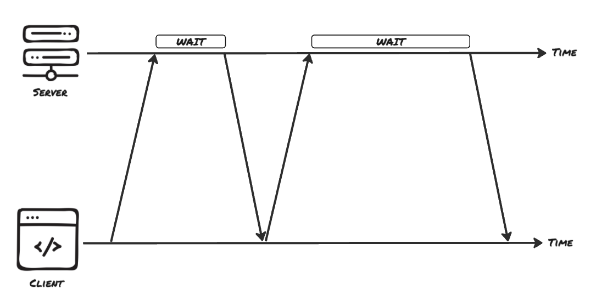

# Real-Time Communication - Long Polling

Short polling wastes most of its requests asking "anything new yet?". The client's underlying issue is guessing when to send the request, while only the server knows when there is actually something to report. Long polling flips that around. Instead of answering instantly with "nothing changed," the server holds the request open and does not send a response until it actually has something new to report. The client still sends an ordinary HTTP request, but now that request acts like a standing question the server answers only when the answer is worth sending.

## Holding the Request Open

When a request arrives and nothing has changed yet, the server simply does not call `res.json()`. The HTTP connection remains open while the server performs its tasks. The browser waits patiently, as from its perspective this is simply a request that is taking a some time to be responded to.

Whenever the server has something new, such as the export job advancing or finishing, it sends the response and closes the request. The client receives the data, processes it, and immediately opens a fresh request to wait for the next change. The effect is a near-instant feed of updates built entirely out of normal HTTP requests, with almost no empty responses in between.



> **_✏️ Note:_** A pending request cannot wait forever. Browsers, load balancers, and proxies all enforce timeouts and will eventually kill an idle connection. Real long-polling servers respond after a maximum wait (often around 30 seconds) even when nothing has changed, sending an empty "keep waiting" answer so the client can reopen the connection before anything times out underneath it.

## Implementing Long Polling

The client code barely changes from short polling. The difference is that there is no timer. A response only arrives when there is real change, so the client reacts to each response by asking again.

```ts
async function waitForUpdate(jobId: string, since: number) {
  const response = await fetch(`/api/exports/${jobId}/updates?since=${since}`);

  // The server waited, nothing changed, and it returned an empty answer.
  if (response.status === 204) {
    waitForUpdate(jobId, since);
    return;
  }

  const job = await response.json();
  updateProgressBar(job.progress);

  if (job.status === "done") {
    showDownloadLink(job.downloadUrl);
    return;
  }

  waitForUpdate(jobId, job.progress); // re-open for the next change
}
```

The `since` value is the client's cursor: the last progress it received. Sending it back lets the server tell a real update apart from state the client already has. Each `fetch` resolves only once the server decides to respond. When it does, the client updates the UI and, unless the job is finished, calls `waitForUpdate` again to reopen the standing question. There is no `setInterval` because the server's timing, not a fixed clock, drives the loop.

On the server, the job announces progress through an event emitter, the same emitter the export work writes to on every change.

```js
import express, { Request, Response } from "express";
import { EventEmitter } from "node:events";

type Job = {
  id: string;
  progress: number; // 0–100
  status: "running" | "done";
  downloadUrl?: string;
  events: EventEmitter;
};

const app = express();
const jobs = new Map<string, Job>();

function runExport(job: Job) {
  const timer = setInterval(() => {
    job.progress = Math.min(job.progress + 10, 100);

    if (job.progress >= 100) {
      job.status = "done";
      job.downloadUrl = `/downloads/${job.id}.csv`;
      clearInterval(timer);
    }

    job.events.emit("progress", job);
  }, 2000);
}
```

A long-poll request that has nothing new to return subscribes to the next event instead of replying.

```ts
app.get("/api/exports/:id/updates", (req: Request, res: Response) => {
  const job = jobs.get(req.params.id);
  if (!job) {
    res.status(404).json({ error: "unknown job" });
    return;
  }

  const since = Number(req.query.since ?? -1);

  // The job is already past what the client has seen → answer immediately.
  if (job.progress > since) {
    res.json({
      status: job.status,
      progress: job.progress,
      downloadUrl: job.downloadUrl,
    });
    return;
  }

  // Nothing new yet: hold the request and wait for the next progress event.
  const onProgress = () => {
    clearTimeout(timer);
    res.json({
      status: job.status,
      progress: job.progress,
      downloadUrl: job.downloadUrl,
    });
  };
  job.events.once("progress", onProgress);

  // Send an empty response before a proxy closes the idle connection.
  const timer = setTimeout(() => {
    job.events.off("progress", onProgress);
    res.status(204).end();
  }, 25_000);

  // If the client disconnects while we are holding, release the listener.
  req.on("close", () => {
    clearTimeout(timer);
    job.events.off("progress", onProgress);
  });
});
```

- The `since` query parameter tells the server what the client last saw, so it can recognise a true update instead of resending old data.
- If the job is already ahead of `since`, the server answers at once. Otherwise it waits.
- `job.events.once("progress", ...)` registers a one-time handler for the next change. When it fires, the server sends the response and the request ends.
- The `setTimeout` guards against waiting too long: after 25 seconds it sends an empty `204` so the client can reopen before any proxy times out.
- The `close` handler removes the listener and the timer if the client goes away first, which keeps idle handlers from piling up.

The emitter here stands in for whatever the real job uses to announce progress: a database notification, a message from a queue, or a callback from the worker doing the export. The shape stays the same: hold the response until there is something worth sending.

## Why It Still Doesn't Scale

Long polling feels like an improvement, and for moderate traffic it is. The data arrives almost instantly and the stream of pointless empty responses is resolved. Nevertheless, this solution still has many drawbacks:

- Each waiting client keeps a connection open. If a server is handling 10,000 long-poll requests, it must maintain 10,000 active connections. Even though most of those requests are simply waiting for data, they still consume memory and other connection-related resources.
- There is a small gap between requests. After a client receives a response, it has to send a new request to continue listening. If an update occurs during that interval, the server needs a way to retain and deliver it with the next request; otherwise, the client may miss it.
- Large updates can trigger a wave of reconnects. When an event causes many long-poll requests to complete at the same time, clients typically reconnect immediately. This can create a short spike in traffic and connection handling overhead.

Long polling can provide near real-time updates without requiring additional protocols, but it comes with inherent overhead. It relies on repeatedly re-establishing HTTP requests to simulate a continuous stream of data. When communication only flows from the server to the client, a persistent connection that delivers updates as they occur is often a simpler and more efficient approach.

## Resources

- [MDN: HTTP request methods](https://developer.mozilla.org/en-US/docs/Web/HTTP/Methods)
- [PubNub: What is Long Polling?](https://www.pubnub.com/guides/long-polling/)
