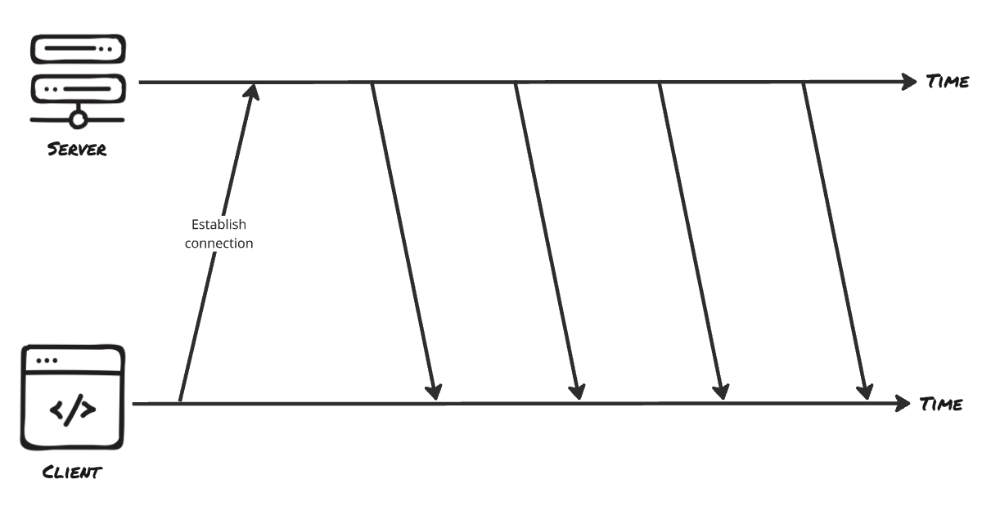

# Real-Time Communication - Server-Sent Events

Polling and long polling both work within the traditional request/response model. They can deliver near real-time updates, but each update eventually requires a new request from the client.

Server-Sent Events take a different approach. The browser opens a single HTTP connection, and the server keeps it open as a continuous stream. Instead of sending one response and closing the connection, the server can push multiple updates over the same connection whenever new data becomes available.

For the export job, this means the browser establishes one connection at the start of the task, and the server can stream progress updates over that connection until the job completes.

## SSE model

Server-Sent Events (SSE) provide a way for a server to push a stream of messages to a client over a single long-lived HTTP connection. Communication is one-way: the server can send data to the client, but the client cannot send messages back over the same connection. If the client needs to communicate with the server, it uses a separate HTTP request.



This model fits many common applications. Progress updates, notification feeds, activity logs, dashboards, and live metrics all follow the same pattern: the server produces a stream of events, and the client only needs to receive and display them. In these cases, SSE is often a simpler alternative to WebSockets, which are designed for full two-way communication and will be discussed later.

> **_💡 Good to know:_** Over HTTP/1.1 a browser allows only about six connections per domain, and each open SSE stream uses one of them. Several streams across several tabs can use up that budget and block other requests to the same domain. HTTP/2 multiplexes many streams over one connection, which removes the limit in practice.

## The EventSource API

Nowadays, browsers provide a built-in API for working with SSE called `EventSource`. You create an `EventSource` with a URL and register event handlers; the browser takes care of managing the connection.

```js
const source = new EventSource(`/api/exports/${jobId}/stream`);

source.onmessage = (event) => {
  const job = JSON.parse(event.data);
  updateProgressBar(job.progress);

  if (job.status === "done") {
    source.close();
  }
};
```

Creating the `EventSource` immediately opens the connection. Every message the server pushes triggers `onmessage`, where `event.data` holds the payload as a string, which is why the example parses it back into an object. Calling `source.close()` ends the stream from the client side once the job is finished.

One useful feature of `EventSource` is its built-in reconnection support. If the connection drops, the browser automatically attempts to reconnect after a short delay. In many cases, no additional client-side code is required.

SSE also supports event IDs. When the server includes an `id` field with each event, the browser remembers the ID of the last event it received. If a reconnection occurs, that value is sent back in the `Last-Event-ID` header. A server that keeps enough event history can use this information to continue streaming from the last known event instead of starting over from the beginning.

It is also possible to send named events for the case a single stream carries different kinds of updates. A message tagged with an `event: progress` line is delivered to `source.addEventListener("progress", ...)` instead of the generic `onmessage` handler, which keeps unrelated update types cleanly separated.

## Implementing SSE in Express.js

On the server-side, we do not need any additional library dependencies to implement SSE (at least in a simple Express.js example). Use a regular route with the correct headers. This keeps writing to the response rather than terminating it:

```ts
import express, { Request, Response } from "express";
import { EventEmitter } from "node:events";

type Job = {
  id: string;
  progress: number; // 0–100
  status: "running" | "done";
  downloadUrl?: string;
  events: EventEmitter;
};

const app = express();
const jobs = new Map<string, Job>();

function runExport(job: Job) {
  const timer = setInterval(() => {
    job.progress = Math.min(job.progress + 10, 100);

    if (job.progress >= 100) {
      job.status = "done";
      job.downloadUrl = `/downloads/${job.id}.csv`;
      clearInterval(timer);
    }

    job.events.emit("progress", job);
  }, 2000);
}
```

The route opens the stream, sends the current state, then writes a new message on every progress event.

```ts
app.get("/api/exports/:id/stream", (req: Request, res: Response) => {
  const job = jobs.get(req.params.id);
  if (!job) {
    res.status(404).end();
    return;
  }

  res.writeHead(200, {
    "Content-Type": "text/event-stream",
    "Cache-Control": "no-cache",
    Connection: "keep-alive",
    "X-Accel-Buffering": "no",
  });

  // set how long the browser waits before reconnecting
  res.write("retry: 3000\n\n");

  // comment frames keep idle proxies from closing the connection.
  const heartbeat = setInterval(() => res.write(": keep-alive\n\n"), 15_000);

  const send = (current: Job) => {
    res.write(`id: ${current.progress}\n`);
    res.write(
      `data: ${JSON.stringify({
        progress: current.progress,
        status: current.status,
        downloadUrl: current.downloadUrl,
      })}\n\n`,
    );

    if (current.status === "done") {
      clearInterval(heartbeat);
      job.events.off("progress", send);
      res.end();
    }
  };

  job.events.on("progress", send);
  send(job);

  req.on("close", () => {
    clearInterval(heartbeat);
    job.events.off("progress", send);
  });
});
```

Every progress event writes one message, and once the job is done the handler stops the heartbeat, detaches its listener, and ends the response.

The right headers turn an ordinary response into an event stream:

- `Content-Type: text/event-stream` tells the browser this is an SSE feed, which is what activates `EventSource` parsing.
- `Cache-Control: no-cache` stops proxies and the browser from buffering or caching the stream.
- `Connection: keep-alive` signals that the connection should stay open rather than close after the first write.
- `X-Accel-Buffering: no` tells nginx, a common reverse proxy, not to buffer the response. Without it the proxy may hold your events and release them in a clump, which defeats the point of a stream.

## SSE Data Format

The message format has its own small protocol. Each message is a line beginning with `data:`, followed by the payload, and terminated by a blank line, which is the `\n\n` at the end. That double newline is not optional decoration; it is the delimiter that tells the browser one event is complete. The code never calls `res.end()` until the job is actually done, because ending the response would close the stream. With the `retry:` message, the server can inform the client to wait a short time before reconnecting if the connection drops.

Here is an example message:

```
data: hello world\n\n

event: chat\n
data: {"from":"Kiki","text":"hi"}\n\n

id: 42\n
data: resumable event\n\n

retry: 5000\n\n
```

## Connection Handling & Resource Cleanup

An SSE endpoint keeps a connection open for an extended period of time, which means any resources associated with that connection must be released when the client disconnects. A user might close the browser tab, navigate away, or lose network connectivity. If the server continues to perform work for a connection that no longer exists, those resources remain allocated unnecessarily.

For that reason, SSE handlers should listen for connection termination. In Express, the `close` event is emitted when the client disconnects:

```ts
req.on("close", () => {
  clearInterval(heartbeat);
  job.events.off("progress", send);
});
```

The route above creates two things per connection: the heartbeat interval and the `progress` listener. If the client disconnects and neither is cleared, the interval keeps firing into a dead response and the listener keeps the handler alive, holding a reference to the job. The same applies to any other per-connection state: subscriptions, entries in a registry, anything created when the stream opened should be torn down when it closes. Skipping this leads to climbing memory use, wasted CPU, and leaks that grow as the application runs.

## Resources

- [MDN: Using server-sent events](https://developer.mozilla.org/en-US/docs/Web/API/Server-sent_events/Using_server-sent_events)
- [MDN: EventSource](https://developer.mozilla.org/en-US/docs/Web/API/EventSource)
- [WHATWG: Server-sent events specification](https://html.spec.whatwg.org/multipage/server-sent-events.html)
