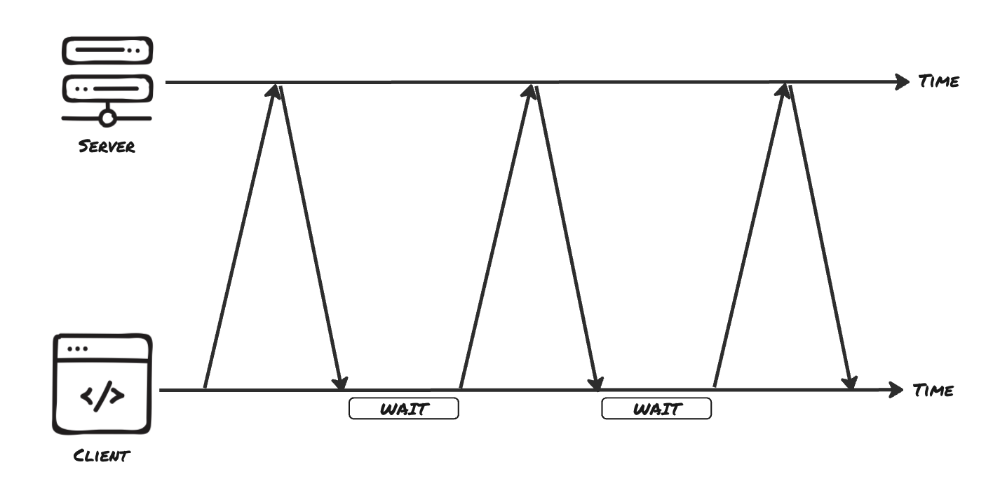

# Real-Time Communication - Short Polling

One fundamental problem with the traditional request/response model is that the server cannot reach back to the client. Here an example: A user clicks "Export to CSV" on a large dataset. The server will start a background job that takes thirty seconds to finish. The browser has no way of knowing when that job is done, because the server cannot reach back out to a client that already hung up. The most trivial solution to this is to keep sending requests until the server has a response ready. This is known as ‘short polling’ and is discussed below.

## How Short Polling Works

Short polling means the client sends the same request on a fixed timer and the server replies immediately with whatever the current state happens to be. There is no new protocol and no special connection. Each poll is an ordinary HTTP request that opens, transfers a small answer, and closes, exactly like any other call to your API.



Using the export example, the cycle looks like this:

- The client starts the export and receives a job ID.
- Every few seconds, the client asks `GET /api/exports/:id` for that job's status.
- The server responds right away with the current progress, whether or not anything has changed.
- Once a response reports that the job is finished, the client stops asking.

The server stays completely stateless. It does not remember that a client is waiting and it does not hold anything open between requests. It just answers each question as it arrives. All of the "waiting" logic lives on the client.

## Polling From the Client

On client-side (browser), the tool for repeating an action on a timer is `setInterval`, paired with `fetch` to make the request.

```ts
// client-side
const POLL_INTERVAL_IN_MS = 3000;

function startPolling(jobId: string) {
  const intervalId = setInterval(async () => {
    const response = await fetch(`/api/exports/${jobId}`);
    const job = await response.json();

    updateProgressBar(job.progress);

    if (job.status === "done") {
      clearInterval(intervalId);
      showDownloadLink(job.downloadUrl);
    }
  }, POLL_INTERVAL_IN_MS);
}
```

`setInterval` returns an `intervalId`, a handle you must keep so you can stop the loop later. Inside the callback, each `fetch` is a fresh, independent request: the server has no idea if it's the fifth or the hundredth time this client has asked. The polling is stopped when `clearInterval(intervalId)` is called.

The server side is a normal route that reads the job's current state and returns it.

```ts
// server-side
import express, { Request, Response } from "express";

type Job = {
  id: string;
  progress: number; // 0–100
  status: "running" | "done";
  downloadUrl?: string;
};

const app = express();
const jobs = new Map<string, Job>();

app.get("/api/exports/:id", (req: Request, res: Response) => {
  const job = jobs.get(req.params.id);

  if (!job) {
    res.status(404).json({ error: "unknown job" });
    return;
  }

  res.json({
    status: job.status,
    progress: job.progress,
    downloadUrl: job.downloadUrl,
  });
});
```

The state the route returns has to change over time, otherwise every poll looks
the same. In a real system the export work updates the job; here a timer stands
in for that work, advancing the progress until it reaches 100.

```ts
function runExport(job: Job) {
  const timer = setInterval(() => {
    job.progress = Math.min(job.progress + 10, 100);

    if (job.progress >= 100) {
      job.status = "done";
      job.downloadUrl = `/downloads/${job.id}.csv`;
      clearInterval(timer);
    }
  }, 2000);
}
```

Each poll reads whatever value `runExport` has reached by then. The client sees the progress increase across several requests and stops once the status is `done`.

## The Cost of Constant Requests

Short polling is easy to build, and for a slow-changing value checked by a handful of users it is a reasonable choice. Below are some drawbacks to keep in mind:

- **Wasted Requests:** Most polls will return nothing new. If you poll every three seconds during a thirty-second task, nine of your ten requests carry no useful information. On each HTTP request your infrastructure still pays the full price of a connection setup, headers, cookies, authentication checks, and usually a database lookup.
- **Server load that scales with clients, not with events:** Ten users polling every three seconds generate roughly 200 requests per minute whether or not anything is happening. The server does constant work to mostly answer "still waiting."
- **Built-in Latency:** A process that finished one second after a poll was made will not be answered until the next poll. A shorter interval might feel more natural but multiplies the request count, while a longer interval reduces server load but makes the UI feel lazy.

> **_💡 Good to know:_** Because every poll hits the same URL, browsers and proxies may serve a cached response and hand your client out-of-date data. Send `Cache-Control: no-store` on the polling endpoint, or add a changing query parameter, so each poll reaches the server instead of the cache.

## Resources

- [MDN: Using Fetch](https://developer.mozilla.org/en-US/docs/Web/API/Fetch_API/Using_Fetch)
- [MDN: setInterval](https://developer.mozilla.org/en-US/docs/Web/API/Window/setInterval)
