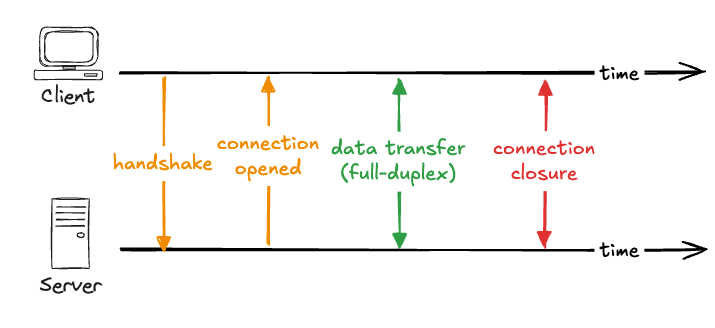

# Real-Time Communication - WebSocket Basics

A WebSocket is one connection that stays open and lets the client and server send to each other at any time. This chapter is about how that connection works underneath: how it starts as an ordinary HTTP request and then turns into something else, what makes it different from a normal request, and how to build one with the low-level tools that everything else sits on top of.





## The Handshake

A WebSocket connection doesn't begin as a WebSocket. It begins as an ordinary HTTP request with one extra header, `Upgrade: websocket`, which is the client asking the server to switch this connection over to the WebSocket protocol. If the server agrees, it replies with `101 Switching Protocols`, and from that point the underlying TCP connection is no longer HTTP. Both sides now exchange WebSocket messages over the same open connection. This negotiation is called the handshake.

Because the connection is no longer HTTP, it uses its own URL scheme. You connect to `ws://` instead of `http://`, and to `wss://` instead of `https://` for the encrypted version that runs over TLS.

## Full-duplex communication

Once the connection is open, it's full-duplex. In a standard request/response exchange the participants take turns: one makes a request, and the other provides a response. Full-duplex means both ends can send at the same time, without waiting for a reply. The server can push a message immediately when something happens, even while the client is busy sending one of its own.

## WebSockets vs. HTTP

An HTTP request is a self-contained transaction: it opens, sends a full set of headers and cookies, gets one response, and closes. The next request starts over from scratch. A WebSocket is opened once and kept open. After the handshake, each message is a small frame with only a few bytes of overhead, sent by whichever side has something to say.

The advantages follow from that:

- **Low latency.** No connection setup or handshake per message. The connection is already open, so a message goes straight through.
- **Low overhead.** Messages are lightweight frames rather than full HTTP requests that carry headers and cookies every time.
- **True two-way communication.** The server can initiate, not just respond, which is the main reason to use WebSockets.

Those wins aren't free, and the costs are mostly about state:

- **The connection is stateful.** The server has to track every open socket, which uses memory and makes scaling harder than with stateless requests. Running multiple server instances usually requires sticky sessions and a way for instances to share messages.
- **You manage reliability yourself.** Connections drop. Raw WebSockets do not reconnect on their own, so detecting a dropped connection and re-establishing it is your job.
- **Infrastructure has to support it.** Some proxies and load balancers need explicit configuration to keep a long-lived upgraded connection open, and responses can't be cached the way plain HTTP responses can.

## Native WebSockets

Node doesn't support WebSockets on its own, so the usual low-level library is `ws`. You attach a WebSocket server to the same HTTP server Express is already running, then handle connections and messages as they arrive.

```ts
import express from "express";
import { WebSocketServer, WebSocket } from "ws";

const app = express();
const server = app.listen(3000);

const wss = new WebSocketServer({ server });

wss.on("connection", (socket: WebSocket) => {
  socket.on("message", (data) => {
    // relay the message to every connected client
    for (const client of wss.clients) {
      if (client.readyState === WebSocket.OPEN) {
        client.send(data.toString());
      }
    }
  });
});
```

The `WebSocketServer` shares the existing HTTP server, so the upgrade handshake can happen on the same port. Its `connection` event fires once per client and gives you a `socket` for that one client. Each socket has its own `message` event for data coming from that client. Here the server loops over `wss.clients`, the set of everyone currently connected, and sends the message to all of them. That's the simplest kind of broadcast.

On the browser, the WebSocket client is built in.

```ts
const socket = new WebSocket("ws://localhost:3000");

socket.addEventListener("open", () => {
  socket.send("hello from the client");
});

socket.addEventListener("message", (event) => {
  console.log("received:", event.data);
});
```

Creating a `WebSocket` opens the connection. The `open` event tells you the handshake succeeded and the connection is ready, so that's when it's safe to start sending. The `message` event fires every time the server sends data, and the payload in `event.data`. Together the two snippets show full-duplex working: the client sends when the connection opens, the server relays the message to everyone, and every client receives it.

> **_❗ Watch out:_** The `ws` module gives you the raw protocol and nothing else. There's no automatic reconnection, and no concept of rooms or channels. If a network blocks WebSockets, there's no fallback. Messages are plain strings that you serialise and parse by hand. In production you rarely want to build all of that yourself, so most teams use a higher-level library instead.

## Resources

- [MDN: The WebSocket API](https://developer.mozilla.org/en-US/docs/Web/API/WebSockets_API)
- [MDN: Writing WebSocket client applications](https://developer.mozilla.org/en-US/docs/Web/API/WebSockets_API/Writing_WebSocket_client_applications)
- [ws library documentation](https://github.com/websockets/ws)
